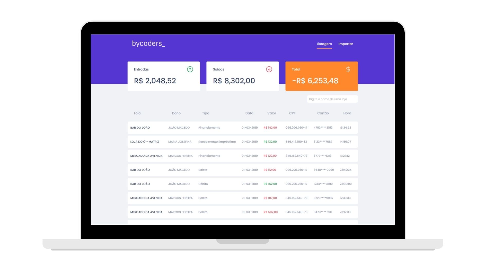

<div align="center">

<p align="center">
  
  
</p>

**Desafio ByCoders**


<p align="center">
  
<p>

</div>

### Features

- Possibility to include different types of transactions and check out the incomes, outcomes, and balance.
- Allow the import of a TXT file to generate new records in the database.

### Summary

- [Technology](#rocket-technology)
  - [Application](#computer-web)
- [How to run](#boom-how-to-run)
  - [Backend](#hammer-backend)
  - [Frontend](#computer-web-1)


### :rocket: Technology

<div align="center">


</div>


### :computer: Application

The application was developed with [Typescript](https://www.typescriptlang.org/) using the framework [ReactJS](https://reactjs.org/) and [Styled-Components](https://styled-components.com/) for visual proposes.

The backend is using NodeJS with Express and Multer to upload the TXT file and insert new records into the database.

---

# :boom: How to run

- ### **Requirements**

  - It's **necessary** to have **[Node.js](https://nodejs.org/en/)** installed on the computer
  - It's **necessary** to have **[Git](https://git-scm.com/)** installed and configured on the computer
  - Also, it's **necessary** to have a package manager either **[NPM](https://www.npmjs.com/)** or **[Yarn](https://yarnpkg.com/)**.
  - Finally, it is essential to have Docker installed to run database Postgres.


Clone the repository:

```sh
  $ git clone https://github.com/paulo-carvalho93/desafio-dev-bycoders.git
```


### :hammer: Backend

## Configuring Docker
The application use just [Postgres](https://www.postgresql.org/).  For the fastest setup is recommended to use [docker-compose](https://docs.docker.com/compose/), you just need to up all services:

```
$ cd backend
$ docker-compose up -d
```

> Then create one database called: `tests` (in case you would like to run the tests).

### .env
Rename the `.env.example` in the root directory to `.env` then just update with your settings.

|key|description|default
|---|---|---
|APP_PORT|Port number where the app will run.|`3333`
|NODE_ENV|App environment. The typeORM's database choice rely on this key value, so if the environment is `test` the database used will be `tests` otherwise the `POSTGRES_DATABASE` will set the database name.|`development`
|POSTGRES_HOST|Postgres host.|`pg`
|POSTGRES_PORT|Postgres port.|`5432`
|POSTGRES_USER|Postgres user.| `postgres`
|POSTGRES_PASSWORD|Postgres password.| `docker`
|POSTGRES_DATABASE|Application's database name.| `bycoders`


#### Migrations

**FYI: Only for this part of Migrations, you need to set the key inside the .env file POSTGRES_HOST to `localhost` due to creating the new table, after that, you can change it again to `pg`**

```
# Change inside .env file POSTGRES_HOST key from `pg` to `localhost`
$ yarn typeorm migration:run
$ docker-compose down
# Change inside .env file POSTGRES_HOST key from `localhost` to `pg`
$ docker-compose up -d
```
> See more information on [TypeORM Migrations](https://typeorm.io/#/migrations).


```sh
  # API
  $ cd backend
  # Installing project dependencies.
  $ yarn # or npm install

  # Start Web Project
  $ yarn dev:server # or npm dev:server
```
**FYI: You don't need to run ```yarn dev:server``` if you are using docker-compose.**

**URL: http://localhost:3333**

#### Tests

```sh
  # API
  $ cd backend
  # Running tests
  $ yarn test # or npm run test
```


> For tests run create a database called `tests`.

### :computer: Frontend


### .env
Rename the `.env.example` in the root directory to `.env` then just update with your settings.

|key|description|default
|---|---|---
|REACT_APP_API_URL|URL and Port number where the app will access the backend.|`http://localhost:3333`


```sh
  # Frontend
  $ cd frontend
  # Installing project dependencies.
  $ yarn # or npm install

  # Start Web Project
  $ yarn start # or npm start
```
**URL: http://localhost:3000**

## Routes
**Swagger: http://localhost:3333/docs/#/**

|route|HTTP Method|params|description
|:---|:---:|:---:|:---:
|`/transactions`|GET| - |Return transactions.
|`/transactions`|POST|More details about the body below .|Create a new transaction.
|`/transactions/import`|POST|Multipart payload with a `file` field with a `txt` file.|Import transactions from file.

### Requests
* `POST /transactions`

Request body:
```json
{
  "tipo": "Financiamento",
  "valor": "142",
  "cpf": "09620676017",
  "cartao": "4753****3153",
  "data": "2019-03-01T00:00:00.000Z",
  "hora": "15:34:53",
  "dono": "PAULO CARVALHO",
  "loja": "BAR DO PAULO"
}
```

## Tests

```sh
  # Frontend
  $ cd frontend
  # Running tests
  $ yarn test # or npm run test
```
